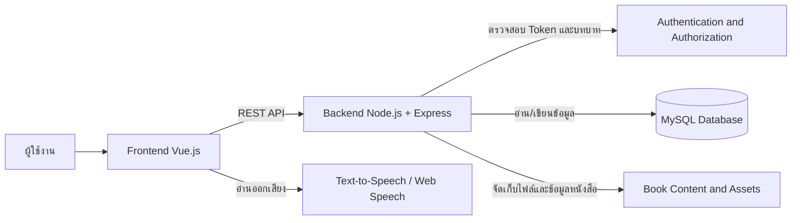
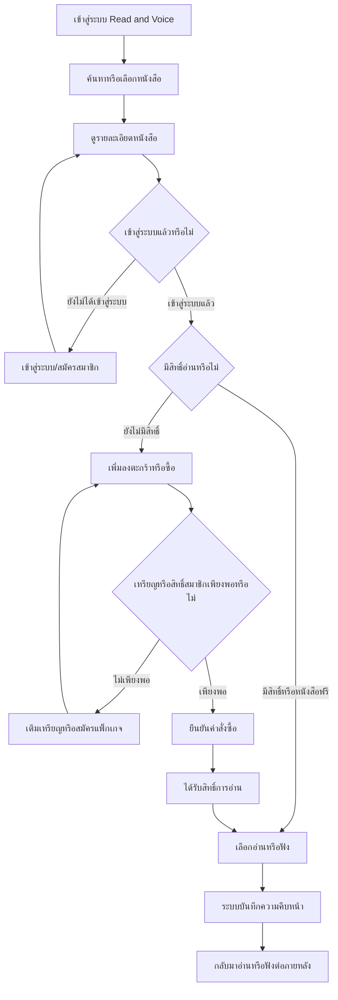
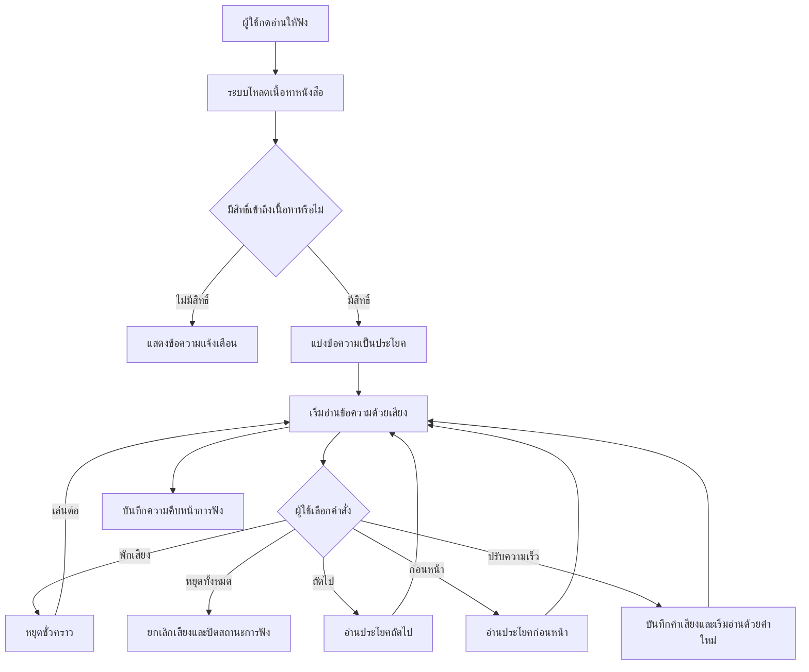
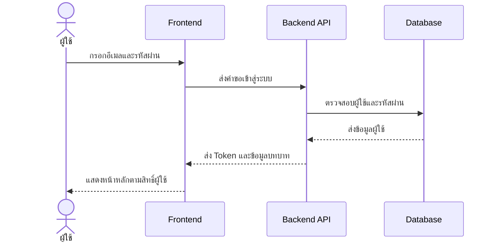
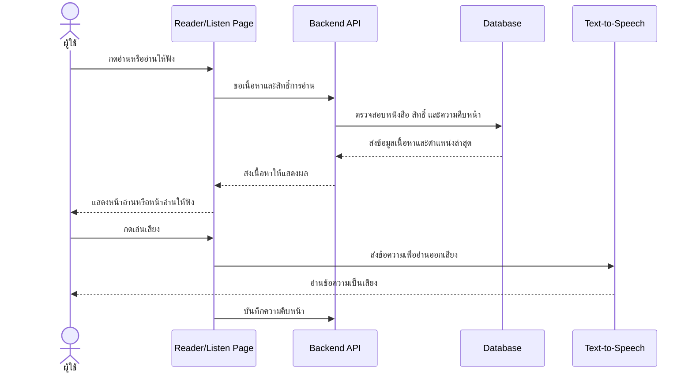
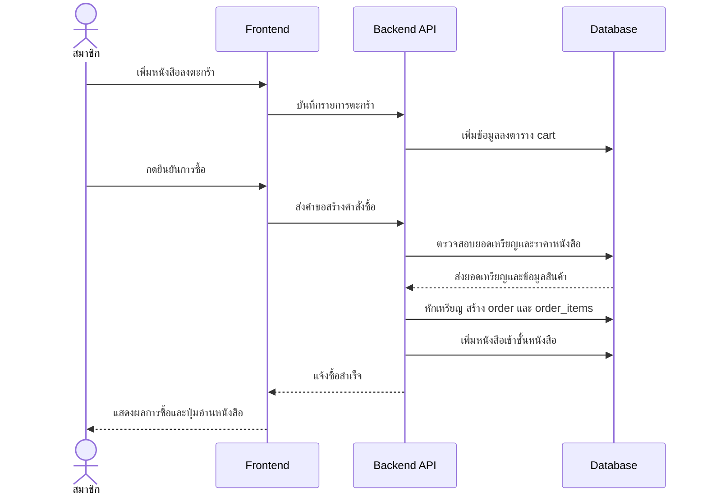
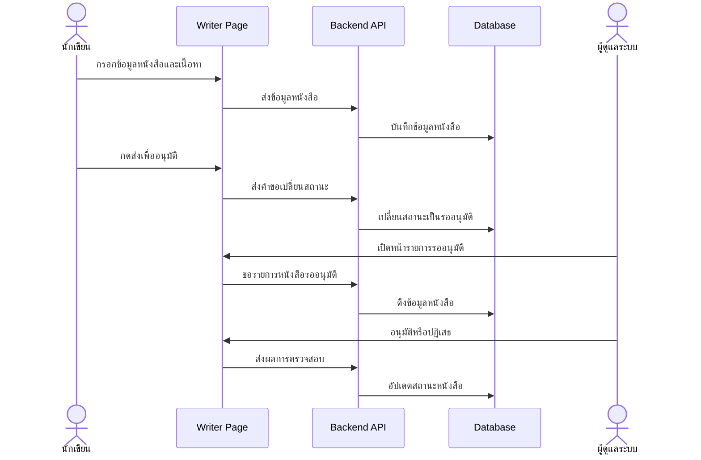
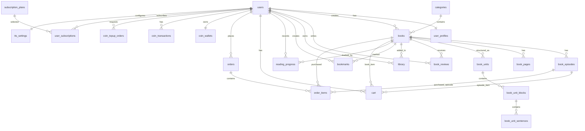

# บทที่ 3
# การวิเคราะห์และออกแบบระบบ

การพัฒนาระบบ Read and Voice เป็นการพัฒนาเว็บแอปพลิเคชันสำหรับให้บริการหนังสือดิจิทัล โดยมุ่งเน้นให้ผู้ใช้งานสามารถค้นหา เลือกซื้อ อ่าน และฟังหนังสือผ่านระบบอ่านข้อความเป็นเสียงได้อย่างสะดวก ระบบออกแบบให้รองรับผู้ใช้งานหลายบทบาท ได้แก่ สมาชิกทั่วไป นักเขียน ผู้ดูแลระบบ และซูเปอร์แอดมิน โดยแต่ละบทบาทมีสิทธิ์และหน้าที่แตกต่างกันตามลักษณะการใช้งาน

ในบทนี้เป็นการอธิบายการวิเคราะห์และออกแบบระบบ โดยประกอบด้วยการวิเคราะห์ความต้องการของผู้ใช้และระบบ การออกแบบกระบวนการทำงาน การออกแบบแผนภาพ UML และ ER Diagram การออกแบบสถาปัตยกรรมระบบ การออกแบบฐานข้อมูล และการออกแบบส่วนติดต่อผู้ใช้ พร้อมทั้งแสดง Input Design และ Output Design ของหน้าจอสำคัญตามขอบเขตของระบบ

## 3.1 การวิเคราะห์ระบบ

### 3.1.1 ภาพรวมของระบบ

ระบบ Read and Voice เป็นเว็บแอปพลิเคชันสำหรับจัดการและให้บริการหนังสือดิจิทัล ผู้ใช้สามารถสมัครสมาชิก เข้าสู่ระบบ ค้นหาหนังสือ ดูรายละเอียดหนังสือ เพิ่มหนังสือเข้าชั้นหนังสือ ซื้อหนังสือ อ่านหนังสือ และฟังหนังสือด้วยเสียงอ่านได้ ระบบมีการบันทึกความคืบหน้าการอ่านและการฟัง เพื่อให้ผู้ใช้สามารถกลับมาอ่านต่อหรือฟังต่อจากตำแหน่งเดิมได้

ระบบยังรองรับการทำงานของนักเขียน โดยนักเขียนสามารถเพิ่มผลงาน แก้ไขข้อมูลหนังสือ เพิ่มตอน กำหนดราคา และส่งผลงานเพื่อรอการอนุมัติจากผู้ดูแลระบบได้ ส่วนผู้ดูแลระบบสามารถจัดการหนังสือ หมวดหมู่ สมาชิก การอนุมัติ การชำระเงิน การเติมเหรียญ และข้อมูลหลังบ้านอื่น ๆ ได้ ซูเปอร์แอดมินมีหน้าที่จัดการผู้ใช้ระดับสูง บทบาทผู้ใช้ และการตั้งค่าระบบ

### 3.1.2 ปัญหาและความจำเป็นของระบบ

การอ่านหนังสือดิจิทัลทั่วไปมักเน้นการแสดงข้อความเป็นหลัก ทำให้ผู้ใช้บางกลุ่ม เช่น ผู้ที่ต้องการฟังระหว่างทำกิจกรรมอื่น ผู้สูงอายุ หรือผู้ที่มีข้อจำกัดด้านการมองเห็น อาจใช้งานได้ไม่สะดวก ระบบ Read and Voice จึงออกแบบให้มีทั้งโหมดอ่านและโหมดฟัง โดยนำข้อความจากหนังสือมาอ่านออกเสียงและมีปุ่มควบคุมเสียง เช่น เล่น หยุดชั่วคราว หยุดทั้งหมด ย้อนกลับ ข้ามประโยค และปรับความเร็วเสียงอ่าน

นอกจากนี้ ระบบยังออกแบบให้รองรับธุรกิจหนังสือดิจิทัลแบบครบวงจร ตั้งแต่การนำเสนอหนังสือ การซื้อขายด้วยเหรียญหรือสิทธิ์สมาชิก การจัดเก็บหนังสือในชั้นหนังสือ การเขียนรีวิว การจัดการผลงานของนักเขียน และการตรวจสอบอนุมัติโดยผู้ดูแลระบบ

### 3.1.3 กลุ่มผู้ใช้งานระบบ

1. ผู้เยี่ยมชมเว็บไซต์  
ผู้เยี่ยมชมสามารถเข้าดูหน้าแรก ร้านหนังสือ รายละเอียดหนังสือ หมวดหมู่ หนังสือใหม่ หนังสือขายดี หนังสือแนะนำ และข้อมูลทั่วไปของเว็บไซต์ได้ แต่หากต้องการซื้อ อ่าน ฟัง หรือจัดเก็บหนังสือ จะต้องเข้าสู่ระบบก่อน

2. สมาชิกหรือผู้อ่าน  
สมาชิกสามารถสมัครสมาชิก เข้าสู่ระบบ ค้นหาหนังสือ เพิ่มหนังสือเข้าชั้นหนังสือ ซื้อหนังสือ เติมเหรียญ สมัครแพ็กเกจสมาชิก อ่านหนังสือ ฟังหนังสือ เขียนรีวิว ดูประวัติคำสั่งซื้อ และจัดการข้อมูลบัญชีของตนเองได้

3. นักเขียน  
นักเขียนสามารถจัดการผลงานของตนเอง เช่น เพิ่มหนังสือ แก้ไขข้อมูลหนังสือ เพิ่มเนื้อหา เพิ่มตอนนิยาย กำหนดราคา ส่งผลงานเพื่อขออนุมัติ และดูสถิติผลงานของตนเองได้

4. ผู้ดูแลระบบ  
ผู้ดูแลระบบสามารถจัดการข้อมูลหลังบ้าน เช่น จัดการหนังสือ จัดการหมวดหมู่ ตรวจสอบรายการรออนุมัติ จัดการสมาชิก ตรวจสอบการชำระเงิน อนุมัติการเติมเหรียญ จัดการแพ็กเกจสมาชิก และจัดการข้อมูลหน้าเว็บไซต์

5. ซูเปอร์แอดมิน  
ซูเปอร์แอดมินสามารถจัดการผู้ใช้ระดับสูง จัดการบทบาทผู้ใช้ ตรวจสอบข้อมูลระบบ และตั้งค่าระบบโดยรวม

### 3.1.4 ความต้องการด้านการทำงานของระบบ

ระบบสมาชิกต้องสามารถสมัครสมาชิก เข้าสู่ระบบ ออกจากระบบ และตรวจสอบสิทธิ์ของผู้ใช้ได้ เมื่อผู้ใช้เข้าสู่ระบบ ระบบต้องทราบบทบาทของผู้ใช้และแสดงเมนูที่เหมาะสมกับสิทธิ์ เช่น สมาชิกทั่วไป นักเขียน ผู้ดูแลระบบ หรือซูเปอร์แอดมิน

ระบบร้านหนังสือต้องสามารถแสดงรายการหนังสือ รายละเอียดหนังสือ หมวดหมู่ แท็ก หนังสือใหม่ หนังสือขายดี หนังสือแนะนำ และหนังสือฟรีได้ ผู้ใช้ต้องสามารถค้นหาหนังสือ เลือกดูรายละเอียด เพิ่มหนังสือเข้าชั้นหนังสือ เพิ่มลงตะกร้า หรือซื้อหนังสือได้

ระบบอ่านหนังสือต้องสามารถแสดงเนื้อหาหนังสือหรือตอนนิยาย ตรวจสอบสิทธิ์ก่อนเปิดอ่าน บันทึกตำแหน่งการอ่านล่าสุด และเปิดอ่านต่อจากตำแหน่งเดิมได้ ผู้ใช้สามารถปรับค่าการอ่าน เช่น ขนาดตัวอักษร ระยะบรรทัด และรูปแบบการอ่านได้

ระบบอ่านให้ฟังต้องสามารถนำข้อความจากหนังสือมาอ่านออกเสียงได้ โดยมีปุ่มควบคุมการเล่นเสียง เช่น เล่น หยุดชั่วคราว เล่นต่อ หยุดทั้งหมด ย้อนประโยค ถัดไป ปรับความเร็ว ปรับเสียง และบันทึกค่าการฟังของผู้ใช้ ระบบต้องลดปัญหาเสียงค้าง และต้องสามารถควบคุมเสียงต่อได้แม้ผู้ใช้ออกจากหน้าอ่านให้ฟังไปยังหน้าอื่นผ่านแผ่นควบคุมย่อ

ระบบซื้อขายต้องสามารถจัดการตะกร้า คำสั่งซื้อ เหรียญ และสิทธิ์การอ่านได้ หากหนังสือเป็นหนังสือฟรี ผู้ใช้สามารถอ่านได้ทันที หากเป็นหนังสือที่ต้องซื้อ ระบบต้องตรวจสอบการชำระเงิน เหรียญคงเหลือ หรือสิทธิ์สมาชิกก่อนอนุญาตให้อ่าน

ระบบนักเขียนต้องสามารถเพิ่มและแก้ไขผลงาน กำหนดประเภทหนังสือ กำหนดราคา เพิ่มตอนหรือเนื้อหา ส่งผลงานเพื่อรออนุมัติ และตรวจสอบสถิติผลงานได้

ระบบผู้ดูแลต้องสามารถอนุมัติหรือปฏิเสธหนังสือ จัดการหมวดหมู่ จัดการสมาชิก ตรวจสอบคำสั่งซื้อและการเติมเหรียญ รวมถึงจัดการข้อมูลหน้าเว็บไซต์และข้อมูลสนับสนุนอื่น ๆ ได้

### 3.1.5 ความต้องการที่ไม่ใช่หน้าที่หลักของระบบ

ระบบต้องมีความปลอดภัยในการเข้าสู่ระบบและการเข้าถึงข้อมูล โดยใช้การตรวจสอบตัวตนและกำหนดสิทธิ์ตามบทบาทของผู้ใช้ ข้อมูลสำคัญ เช่น ข้อมูลบัญชี คำสั่งซื้อ เหรียญ และสิทธิ์การอ่าน ต้องถูกเข้าถึงผ่านผู้ใช้ที่มีสิทธิ์เท่านั้น

ระบบต้องรองรับการใช้งานบนอุปกรณ์หลายขนาด เช่น คอมพิวเตอร์ แท็บเล็ต และโทรศัพท์มือถือ ส่วนติดต่อผู้ใช้ต้องใช้งานง่าย มีข้อความชัดเจน ปุ่มควบคุมเข้าใจง่าย และเหมาะกับผู้ที่ต้องการใช้งานโหมดอ่านหรือโหมดฟัง

ระบบต้องรองรับการเข้าถึงสำหรับผู้ใช้ที่ต้องการความช่วยเหลือ เช่น การอ่านออกเสียงข้อความบนหน้าจอ การควบคุมด้วยคำสั่งเสียงในบางส่วน การปรับตัวอักษร และการใช้ปุ่มควบคุมที่ชัดเจน

## 3.2 การออกแบบระบบ

### 3.2.1 สถาปัตยกรรมระบบ

ระบบ Read and Voice ใช้สถาปัตยกรรมแบบ Client-Server โดยแบ่งออกเป็น 3 ส่วนหลัก ได้แก่ Frontend, Backend และ Database

1. Frontend  
พัฒนาด้วย Vue.js ทำหน้าที่แสดงผลหน้าเว็บ รับข้อมูลจากผู้ใช้ จัดการสถานะหน้าจอ และเรียกใช้งาน Backend API เช่น การเข้าสู่ระบบ การค้นหาหนังสือ การเปิดอ่าน การซื้อหนังสือ และการจัดการข้อมูลหลังบ้าน

2. Backend  
พัฒนาด้วย Node.js และ Express ทำหน้าที่รับคำขอจาก Frontend ตรวจสอบสิทธิ์ ประมวลผลธุรกรรม จัดการข้อมูลผู้ใช้ หนังสือ คำสั่งซื้อ เหรียญ สมาชิก และเชื่อมต่อฐานข้อมูล

3. Database  
ใช้ MySQL สำหรับจัดเก็บข้อมูลหลักของระบบ เช่น ผู้ใช้ หนังสือ หมวดหมู่ ตอน เนื้อหา รีวิว ชั้นหนังสือ ความคืบหน้าการอ่าน ตะกร้า คำสั่งซื้อ เหรียญ แพ็กเกจสมาชิก และค่าการอ่านออกเสียง

4. Text-to-Speech  
ระบบใช้การอ่านข้อความเป็นเสียงผ่านความสามารถของเบราว์เซอร์และบริการอ่านออกเสียงของระบบ เพื่อให้ผู้ใช้สามารถฟังหนังสือได้ พร้อมควบคุมการเล่นเสียงจากหน้าอ่านให้ฟังหรือแผ่นควบคุมย่อ

แผนภาพสถาปัตยกรรมระบบ

คำอธิบายแผนภาพ คือ ผู้ใช้เข้าระบบผ่านเว็บเบราว์เซอร์ จากนั้น Frontend จะรับคำสั่งจากผู้ใช้และส่งคำขอไปยัง Backend ผ่าน REST API หากเป็นคำขอที่ต้องใช้สิทธิ์ Backend จะตรวจสอบ Token และบทบาทก่อนเชื่อมต่อฐานข้อมูล เมื่อได้ข้อมูลแล้วจึงส่งกลับมาให้ Frontend แสดงผล ส่วนการฟังหนังสือจะส่งข้อความไปยังระบบ Text-to-Speech เพื่ออ่านออกเสียง

### 3.2.2 Use Case Diagram

```mermaid
flowchart TB
  Visitor[ผู้เยี่ยมชม]
  User[สมาชิก/ผู้อ่าน]
  Writer[นักเขียน]
  Admin[ผู้ดูแลระบบ]
  Super[ซูเปอร์แอดมิน]

  Visitor --> UC1[ดูหน้าแรกและร้านหนังสือ]
  Visitor --> UC2[ค้นหาและดูรายละเอียดหนังสือ]
  Visitor --> UC3[สมัครสมาชิก/เข้าสู่ระบบ]

  User --> UC4[จัดการโปรไฟล์]
  User --> UC5[เพิ่มหนังสือเข้าชั้นหนังสือ]
  User --> UC6[ซื้อหนังสือและเติมเหรียญ]
  User --> UC7[อ่านหนังสือ]
  User --> UC8[ฟังหนังสือ]
  User --> UC9[เขียนรีวิว]
  User --> UC10[ดูประวัติคำสั่งซื้อ]

  Writer --> UC11[จัดการผลงาน]
  Writer --> UC12[เพิ่มเนื้อหาและตอน]
  Writer --> UC13[ส่งผลงานเพื่ออนุมัติ]
  Writer --> UC14[ดูสถิติผลงาน]

  Admin --> UC15[จัดการหนังสือและหมวดหมู่]
  Admin --> UC16[อนุมัติผลงาน]
  Admin --> UC17[จัดการสมาชิก]
  Admin --> UC18[ตรวจสอบการชำระเงิน]
  Admin --> UC19[จัดการข้อมูลหน้าเว็บ]

  Super --> UC20[จัดการบทบาทผู้ใช้]
  Super --> UC21[ตั้งค่าระบบ]
```

คำอธิบาย Use Case คือ ผู้เยี่ยมชมสามารถดูข้อมูลทั่วไปและสมัครสมาชิกได้ เมื่อเข้าสู่ระบบเป็นสมาชิกจะสามารถซื้อ อ่าน ฟัง และรีวิวหนังสือได้ หากมีบทบาทนักเขียนจะสามารถจัดการผลงานของตนเองได้ ส่วนผู้ดูแลระบบมีหน้าที่จัดการข้อมูลหลังบ้านและอนุมัติผลงาน ซูเปอร์แอดมินมีสิทธิ์สูงสุดในการกำหนดบทบาทและตั้งค่าระบบ

### 3.2.3 Flowchart การค้นหา ซื้อ อ่าน และฟังหนังสือ

คำอธิบาย Flowchart คือ ผู้ใช้เริ่มจากการค้นหาหรือเลือกหนังสือ หากยังไม่ได้เข้าสู่ระบบ ระบบจะให้เข้าสู่ระบบก่อน เมื่อเข้าสู่ระบบแล้ว ระบบจะตรวจสอบสิทธิ์การอ่าน หากมีสิทธิ์จะสามารถอ่านหรือฟังได้ทันที หากไม่มีสิทธิ์ต้องซื้อหนังสือหรือใช้สิทธิ์สมาชิกก่อน เมื่ออ่านหรือฟังแล้ว ระบบจะบันทึกความคืบหน้าไว้

### 3.2.4 Flowchart การอ่านให้ฟัง

คำอธิบาย Flowchart คือ เมื่อผู้ใช้เปิดหน้าอ่านให้ฟัง ระบบจะตรวจสอบสิทธิ์และโหลดเนื้อหา จากนั้นแบ่งข้อความเป็นประโยคเพื่อควบคุมการอ่านทีละช่วง ผู้ใช้สามารถเล่นเสียง หยุดชั่วคราว เล่นต่อ หยุดทั้งหมด ย้อนกลับ ข้ามไปประโยคถัดไป และปรับความเร็วได้ ระบบจะบันทึกตำแหน่งล่าสุดเพื่อให้กลับมาฟังต่อได้

### 3.2.5 Sequence Diagram การเข้าสู่ระบบ

คำอธิบาย คือ ผู้ใช้กรอกอีเมลและรหัสผ่าน จากนั้นระบบ Frontend ส่งข้อมูลไปยัง Backend เพื่อตรวจสอบกับฐานข้อมูล หากข้อมูลถูกต้อง Backend จะส่ง Token และข้อมูลผู้ใช้กลับมา Frontend จึงจัดเก็บข้อมูลการเข้าสู่ระบบและนำผู้ใช้ไปยังหน้าที่เหมาะสม

### 3.2.6 Sequence Diagram การอ่านและฟังหนังสือ

คำอธิบาย คือ เมื่อผู้ใช้กดอ่านหรือฟัง ระบบจะตรวจสอบสิทธิ์ก่อนเสมอ หากมีสิทธิ์ ระบบจะแสดงเนื้อหาและโหลดตำแหน่งอ่านล่าสุด เมื่อผู้ใช้กดเล่นเสียง ระบบจะส่งข้อความไปยัง Text-to-Speech และบันทึกความคืบหน้าระหว่างการใช้งาน

### 3.2.7 Sequence Diagram การซื้อหนังสือด้วยเหรียญ

คำอธิบาย คือ ผู้ใช้เพิ่มหนังสือลงตะกร้าและกดยืนยันการซื้อ Backend จะตรวจสอบยอดเหรียญ หากเพียงพอจะหักเหรียญ สร้างคำสั่งซื้อ เก็บรายการสินค้า และเพิ่มหนังสือเข้าชั้นหนังสือของผู้ใช้

### 3.2.8 Sequence Diagram การส่งผลงานของนักเขียนเพื่ออนุมัติ

คำอธิบาย คือ นักเขียนเพิ่มข้อมูลหนังสือและส่งเพื่อขออนุมัติ ผู้ดูแลระบบจะตรวจรายการรออนุมัติและเลือกอนุมัติหรือปฏิเสธ ผลการตรวจสอบจะถูกบันทึกในฐานข้อมูลและนำไปใช้กำหนดการแสดงผลบนหน้าร้านหนังสือ

## 3.3 การออกแบบฐานข้อมูล

ฐานข้อมูลของระบบ Read and Voice ออกแบบเพื่อรองรับการจัดเก็บข้อมูลผู้ใช้ หนังสือ เนื้อหา การอ่าน การฟัง การซื้อขาย เหรียญ สมาชิก รีวิว และการจัดการหลังบ้าน โดยตารางสำคัญมีดังนี้

### 3.3.1 รายการตารางฐานข้อมูลหลัก

| ตาราง | รายละเอียด |
|---|---|
| users | เก็บข้อมูลผู้ใช้ เช่น ชื่อ อีเมล รหัสผ่าน บทบาท และสถานะบัญชี |
| user_profiles | เก็บข้อมูลโปรไฟล์ผู้ใช้และข้อมูลเสริมของบัญชี |
| categories | เก็บหมวดหมู่หนังสือ |
| books | เก็บข้อมูลหนังสือ เช่น ชื่อ ผู้เขียน ราคา ประเภท สถานะ และผู้สร้าง |
| book_episodes | เก็บข้อมูลตอนของนิยายรายตอน |
| book_pages | เก็บเนื้อหาหนังสือแบบหน้า |
| book_units | เก็บหน่วยเนื้อหาหนังสือสำหรับจัดโครงสร้างการอ่าน |
| book_unit_blocks | เก็บบล็อกข้อความของหนังสือ |
| book_unit_sentences | เก็บประโยคของหนังสือเพื่อใช้กับการอ่านออกเสียง |
| book_reviews | เก็บคะแนนและความคิดเห็นของผู้ใช้ต่อหนังสือ |
| library | เก็บข้อมูลชั้นหนังสือของผู้ใช้ |
| bookmarks | เก็บตำแหน่งคั่นหน้าของผู้ใช้ |
| reading_progress | เก็บความคืบหน้าการอ่านและการฟังของผู้ใช้ |
| cart | เก็บรายการหนังสือหรือตอนที่ผู้ใช้เพิ่มลงตะกร้า |
| orders | เก็บข้อมูลคำสั่งซื้อ |
| order_items | เก็บรายการสินค้าในคำสั่งซื้อ |
| coin_wallets | เก็บยอดเหรียญคงเหลือของผู้ใช้ |
| coin_transactions | เก็บประวัติการรับและใช้เหรียญ |
| coin_topup_orders | เก็บรายการเติมเหรียญที่รอการตรวจสอบ |
| subscription_plans | เก็บข้อมูลแพ็กเกจสมาชิก |
| user_subscriptions | เก็บประวัติและสถานะสมาชิกของผู้ใช้ |
| tts_settings | เก็บค่าการอ่านออกเสียง เช่น ความเร็ว ระดับเสียง และเสียงที่เลือก |
| tts_user_settings | เก็บค่าการฟังเพิ่มเติมของผู้ใช้ |
| admin_settings | เก็บค่าตั้งค่าของระบบ |
| support_tickets | เก็บรายการแจ้งปัญหาหรือคำร้องขอความช่วยเหลือ |

### 3.3.2 Entity Relationship Diagram

### 3.3.3 คำอธิบายความสัมพันธ์ของข้อมูล

ผู้ใช้หนึ่งคนมีข้อมูลโปรไฟล์หนึ่งรายการ และสามารถมีบทบาทแตกต่างกันได้ เช่น user, writer, admin หรือ superadmin หากผู้ใช้มีบทบาทเป็นนักเขียนจะสามารถสร้างหนังสือได้หลายเล่ม หนังสือแต่ละเล่มสามารถอยู่ในหมวดหมู่หนึ่งหมวดหมู่ และอาจมีเนื้อหาได้หลายรูปแบบ เช่น หน้า หนังสือแบบมีโครงสร้าง หรือนิยายรายตอน

หนังสือหนึ่งเล่มสามารถมีตอนหลายตอน และสามารถมีหน่วยเนื้อหา บล็อกข้อความ และประโยคหลายรายการ เพื่อให้ระบบสามารถแสดงเนื้อหาและอ่านออกเสียงทีละประโยคได้อย่างเป็นระเบียบ ผู้ใช้สามารถบันทึกความคืบหน้าในการอ่านหรือฟังหนังสือผ่านตาราง reading_progress

ผู้ใช้สามารถเพิ่มหนังสือเข้าชั้นหนังสือได้หลายเล่ม และหนังสือหนึ่งเล่มสามารถอยู่ในชั้นหนังสือของผู้ใช้หลายคนได้ ความสัมพันธ์นี้ถูกจัดเก็บในตาราง library ผู้ใช้ยังสามารถเขียนรีวิวหนังสือได้ โดยรีวิวหนึ่งรายการเชื่อมโยงกับผู้ใช้หนึ่งคนและหนังสือหนึ่งเล่ม

ส่วนการซื้อขายประกอบด้วย cart, orders และ order_items เมื่อผู้ใช้ซื้อหนังสือ ระบบจะตรวจสอบยอดเหรียญใน coin_wallets และบันทึกการเปลี่ยนแปลงใน coin_transactions หากผู้ใช้เติมเหรียญ รายการเติมเหรียญจะถูกบันทึกใน coin_topup_orders เพื่อรอการตรวจสอบจากผู้ดูแลระบบ

ระบบสมาชิกประกอบด้วย subscription_plans และ user_subscriptions เพื่อจัดเก็บข้อมูลแพ็กเกจและสถานะการสมัครสมาชิกของผู้ใช้ ส่วนค่าการฟัง เช่น ความเร็วเสียง ระดับเสียง และเสียงที่เลือก จะถูกจัดเก็บใน tts_settings หรือค่าที่เกี่ยวข้องกับผู้ใช้

### 3.3.4 โครงสร้างข้อมูลสำคัญ

| ตาราง | ฟิลด์สำคัญ | คำอธิบาย |
|---|---|---|
| users | id, name, email, password, role, status | ใช้ระบุตัวตนและสิทธิ์ของผู้ใช้ |
| books | id, title, author, category_id, price, access_type, status, created_by | ใช้จัดเก็บข้อมูลหลักของหนังสือ |
| book_episodes | id, book_id, episode_number, title, content, price | ใช้จัดเก็บตอนของนิยายรายตอน |
| book_unit_sentences | id, unit_id, block_id, sentence_order, tts_text | ใช้จัดเก็บประโยคสำหรับอ่านออกเสียง |
| reading_progress | user_id, book_id, progress_percent, last_position_ms, reading_mode | ใช้บันทึกตำแหน่งอ่านหรือฟังล่าสุด |
| cart | user_id, book_id, episode_id | ใช้เก็บรายการที่ผู้ใช้ต้องการซื้อ |
| orders | id, user_id, total_amount, status | ใช้เก็บข้อมูลคำสั่งซื้อ |
| order_items | order_id, book_id, episode_id, price | ใช้เก็บรายละเอียดสินค้าในคำสั่งซื้อ |
| coin_wallets | user_id, balance | ใช้เก็บยอดเหรียญคงเหลือ |
| coin_transactions | user_id, amount, balance_after, reference_type | ใช้เก็บประวัติธุรกรรมเหรียญ |
| tts_settings | user_id, voice_name, rate, pitch, volume | ใช้เก็บค่าการอ่านออกเสียง |

## 3.4 การออกแบบส่วนติดต่อผู้ใช้

การออกแบบส่วนติดต่อผู้ใช้ของระบบ Read and Voice เน้นให้ผู้ใช้สามารถทำงานหลักได้ง่าย ได้แก่ ค้นหา ซื้อ อ่าน และฟังหนังสือ หน้าจอถูกออกแบบให้มีลำดับการใช้งานชัดเจน ปุ่มสำคัญมองเห็นง่าย รองรับหน้าจอหลายขนาด และรองรับผู้ใช้ที่ต้องการฟังเสียงอ่านหรือใช้คำสั่งช่วยเหลือด้านการเข้าถึง

### 3.4.1 หน้าแรก

หน้าแรกเป็นหน้าต้อนรับผู้ใช้ แสดงหนังสือเด่น หมวดหมู่ หนังสือใหม่ หนังสือขายดี หนังสือแนะนำ และทางลัดไปยังหน้าสำคัญ เช่น ร้านหนังสือ ชั้นหนังสือ และหน้าสมัครสมาชิก

Input Design: คลิกเมนู ค้นหาหนังสือ เลือกหมวดหมู่ เลือกหนังสือ  
Output Design: แสดงรายการหนังสือ แบนเนอร์ หมวดหมู่ หนังสือแนะนำ และปุ่มนำทาง

### 3.4.2 หน้าร้านหนังสือ

หน้าร้านหนังสือใช้แสดงรายการหนังสือทั้งหมด ผู้ใช้สามารถค้นหาและคัดกรองหนังสือตามหมวดหมู่ ประเภท ราคา หรือความนิยมได้

Input Design: กรอกคำค้นหา เลือกหมวดหมู่ เลือกแท็ก เลือกหนังสือ  
Output Design: รายการหนังสือ ชื่อเรื่อง ผู้เขียน ราคา ปกหนังสือ ประเภท และปุ่มดูรายละเอียด

### 3.4.3 หน้ารายละเอียดหนังสือ

หน้ารายละเอียดหนังสือแสดงข้อมูลหนังสือ เช่น ชื่อเรื่อง ผู้เขียน หมวดหมู่ ราคา เรื่องย่อ รายการตอน รีวิว และสถานะสิทธิ์การอ่าน

Input Design: กดอ่าน กดอ่านให้ฟัง เพิ่มเข้าชั้นหนังสือ เพิ่มลงตะกร้า ซื้อหนังสือ เขียนรีวิว เลือกตอน  
Output Design: รายละเอียดหนังสือ สถานะสิทธิ์อ่าน รายการตอน รีวิว คะแนนเฉลี่ย และข้อความแจ้งผลการทำรายการ

### 3.4.4 หน้าอ่านหนังสือ

หน้าอ่านหนังสือใช้สำหรับแสดงเนื้อหาของหนังสือหรือเนื้อหาตอน ผู้ใช้สามารถอ่านต่อจากตำแหน่งเดิม เปลี่ยนค่าการอ่าน และบันทึกความคืบหน้าได้

Input Design: เลื่อนอ่าน เลือกตอน ปรับขนาดตัวอักษร ปรับระยะบรรทัด เปลี่ยนโหมดสี กดอ่านให้ฟัง  
Output Design: เนื้อหาหนังสือ ความคืบหน้า ตำแหน่งล่าสุด ปุ่มตอนก่อนหน้า/ถัดไป และตัวเลือกการอ่าน

### 3.4.5 หน้าอ่านให้ฟัง

หน้าอ่านให้ฟังใช้สำหรับอ่านข้อความเป็นเสียง ระบบจะแบ่งข้อความเป็นประโยคและอ่านทีละประโยค ผู้ใช้สามารถควบคุมการฟังได้ เช่น เล่น พักเสียง เล่นต่อ หยุดทั้งหมด ย้อนกลับ ถัดไป และปรับความเร็ว

Input Design: กดเล่น กดพัก กดหยุด กดย้อนประโยค กดถัดไป ปรับความเร็ว ปรับระดับเสียง เลือกเสียงอ่าน  
Output Design: เสียงอ่าน ข้อความประโยคปัจจุบัน ความคืบหน้าในการฟัง สถานะกำลังเล่นหรือพัก และค่าการฟังล่าสุด

### 3.4.6 แผ่นควบคุมอ่านให้ฟังแบบย่อ

แผ่นควบคุมอ่านให้ฟังแบบย่อแสดงเมื่อผู้ใช้ออกจากหน้าอ่านให้ฟังไปยังหน้าอื่น เพื่อให้ยังสามารถควบคุมเสียงได้โดยไม่ต้องกลับไปที่หน้าอ่านให้ฟังทันที

Input Design: กดเล่นหรือพัก กดหยุด กดย้อนประโยค กดถัดไป กดเพิ่มหรือลดความเร็ว กดกลับไปหน้าอ่านให้ฟัง  
Output Design: สถานะหนังสือที่กำลังฟัง ชื่อหนังสือ ตำแหน่งประโยค และสถานะการเล่นเสียง

### 3.4.7 หน้าชั้นหนังสือของฉัน

หน้าชั้นหนังสือแสดงหนังสือที่ผู้ใช้มีสิทธิ์อ่านหรือเพิ่มไว้ ผู้ใช้สามารถค้นหาในชั้นหนังสือและกลับไปอ่านต่อได้

Input Design: ค้นหาหนังสือ เลือกหนังสือ กดอ่านต่อ กดฟังต่อ  
Output Design: รายการหนังสือของผู้ใช้ ความคืบหน้า ปุ่มอ่านต่อ และสถานะสิทธิ์การอ่าน

### 3.4.8 หน้าตะกร้า

หน้าตะกร้าแสดงหนังสือหรือตอนที่ผู้ใช้ต้องการซื้อ พร้อมยอดรวมและปุ่มชำระเงิน

Input Design: ลบรายการ เปลี่ยนรายการ กดยืนยันการซื้อ  
Output Design: รายการสินค้า ราคา ยอดรวม สถานะเหรียญ และผลการชำระเงิน

### 3.4.9 หน้าประวัติคำสั่งซื้อ

หน้าประวัติคำสั่งซื้อแสดงรายการซื้อหนังสือและสถานะการชำระเงินของผู้ใช้

Input Design: เลือกรายการคำสั่งซื้อ ดูรายละเอียด  
Output Design: เลขคำสั่งซื้อ รายการหนังสือ วันที่ซื้อ ยอดรวม และสถานะคำสั่งซื้อ

### 3.4.10 หน้าเติมเหรียญ

หน้าเติมเหรียญใช้แสดงยอดเหรียญคงเหลือ แพ็กเกจเหรียญ และประวัติการเติมเหรียญ

Input Design: เลือกแพ็กเกจ กรอกข้อมูลการชำระเงิน แนบหลักฐาน กดยืนยัน  
Output Design: ยอดเหรียญ รายการเติมเหรียญ สถานะรอตรวจสอบ อนุมัติ หรือปฏิเสธ

### 3.4.11 หน้าแพ็กเกจสมาชิก

หน้าแพ็กเกจสมาชิกแสดงแพ็กเกจที่ผู้ใช้สามารถสมัครเพื่อรับสิทธิ์การอ่านตามเงื่อนไขของระบบ

Input Design: เลือกแพ็กเกจ กดยืนยันการสมัคร  
Output Design: รายละเอียดแพ็กเกจ ราคา ระยะเวลา สิทธิ์ที่ได้รับ และสถานะสมาชิก

### 3.4.12 หน้านักเขียน

หน้านักเขียนประกอบด้วยแดชบอร์ดนักเขียน รายการหนังสือของฉัน หน้าเพิ่มหนังสือ หน้าแก้ไขหนังสือ และหน้าสถิติผลงาน

Input Design: กรอกข้อมูลหนังสือ เพิ่มหรือแก้ไขเนื้อหา กำหนดราคา กดบันทึก กดส่งอนุมัติ  
Output Design: รายการผลงาน สถานะหนังสือ สถานะอนุมัติ สถิติยอดอ่าน ยอดขาย และข้อความแจ้งผลการบันทึก

### 3.4.13 หน้าผู้ดูแลระบบ

หน้าผู้ดูแลระบบใช้จัดการข้อมูลหลังบ้าน เช่น หนังสือ หมวดหมู่ สมาชิก การอนุมัติ การชำระเงิน การเติมเหรียญ ซัพพอร์ต และข้อมูลหน้าเว็บ

Input Design: ค้นหา แก้ไข เพิ่ม ลบ อนุมัติ ปฏิเสธ เปลี่ยนสถานะ  
Output Design: ตารางข้อมูล รายละเอียดรายการ สถานะล่าสุด ผลการอนุมัติ และข้อความแจ้งผลการทำงาน

### 3.4.14 หน้าซูเปอร์แอดมิน

หน้าซูเปอร์แอดมินใช้จัดการผู้ใช้ บทบาท และการตั้งค่าระบบที่มีผลกับทั้งระบบ

Input Design: เลือกผู้ใช้ เปลี่ยนบทบาท อนุมัติสิทธิ์ผู้ดูแล แก้ไขค่าระบบ  
Output Design: รายชื่อผู้ใช้ บทบาทล่าสุด สถานะการอนุมัติ และค่าระบบที่อัปเดตแล้ว

## 3.5 การออกแบบ Input และ Output ของระบบ

| หน้าจอ | Input | Process | Output |
|---|---|---|---|
| สมัครสมาชิก | ชื่อ อีเมล รหัสผ่าน | ตรวจสอบข้อมูลและบันทึกผู้ใช้ใหม่ | บัญชีผู้ใช้ใหม่หรือข้อความแจ้งข้อผิดพลาด |
| เข้าสู่ระบบ | อีเมล รหัสผ่าน | ตรวจสอบรหัสผ่านและสร้าง Token | เข้าสู่ระบบสำเร็จและนำทางตามบทบาท |
| ร้านหนังสือ | คำค้นหา หมวดหมู่ แท็ก | ค้นหาและกรองหนังสือจากฐานข้อมูล | รายการหนังสือตรงเงื่อนไข |
| รายละเอียดหนังสือ | เลือกอ่าน ฟัง ซื้อ รีวิว | ตรวจสอบสิทธิ์และบันทึกการกระทำ | รายละเอียดหนังสือ สถานะสิทธิ์ และผลทำรายการ |
| หน้าอ่าน | เลื่อนอ่าน ปรับตัวอักษร เลือกตอน | โหลดเนื้อหาและบันทึกความคืบหน้า | เนื้อหาและตำแหน่งอ่านล่าสุด |
| หน้าอ่านให้ฟัง | เล่น พัก หยุด ถัดไป ก่อนหน้า ปรับสปีด | แบ่งข้อความและสั่งอ่านข้อความเป็นเสียง | เสียงอ่าน สถานะเล่น และความคืบหน้าการฟัง |
| ชั้นหนังสือ | เลือกหนังสือ ค้นหา อ่านต่อ | ดึงรายการหนังสือของผู้ใช้ | หนังสือในชั้นและความคืบหน้า |
| ตะกร้า | เพิ่ม ลบ ยืนยันซื้อ | คำนวณยอดรวมและตรวจสอบเหรียญ | คำสั่งซื้อหรือข้อความแจ้งเหรียญไม่พอ |
| เติมเหรียญ | เลือกแพ็กเกจ ส่งหลักฐาน | บันทึกรายการรอตรวจสอบ | สถานะรายการเติมเหรียญ |
| นักเขียนอัปโหลด | ข้อมูลหนังสือ เนื้อหา ราคา | บันทึกผลงานและสถานะ | หนังสือใหม่หรือสถานะรออนุมัติ |
| แอดมินอนุมัติ | อนุมัติ/ปฏิเสธ หมายเหตุ | อัปเดตสถานะหนังสือ | สถานะอนุมัติล่าสุด |
| ซูเปอร์แอดมิน | บทบาทผู้ใช้ ค่าระบบ | ตรวจสอบสิทธิ์และอัปเดตข้อมูล | บทบาทหรือค่าระบบที่เปลี่ยนแปลงแล้ว |

## 3.6 การกำหนดสิทธิ์การเข้าถึงระบบ

ระบบกำหนดสิทธิ์ตามบทบาทของผู้ใช้ เพื่อป้องกันการเข้าถึงข้อมูลที่ไม่เกี่ยวข้อง โดยแบ่งเป็น 4 บทบาทหลัก ได้แก่ user, writer, admin และ superadmin

| บทบาท | สิทธิ์การใช้งาน |
|---|---|
| user | อ่าน ฟัง ซื้อหนังสือ เติมเหรียญ เขียนรีวิว จัดการชั้นหนังสือและโปรไฟล์ |
| writer | ใช้งานสิทธิ์ของ user และจัดการผลงานของตนเอง |
| admin | จัดการหนังสือ หมวดหมู่ สมาชิก การอนุมัติ การชำระเงิน และข้อมูลหลังบ้าน |
| superadmin | ใช้งานสิทธิ์ผู้ดูแลระบบ และจัดการบทบาทผู้ใช้หรือค่าระบบระดับสูง |

เมื่อผู้ใช้เรียกใช้งานหน้าหรือ API ที่ต้องเข้าสู่ระบบ ระบบจะตรวจสอบ Token ก่อน หากไม่มี Token จะนำไปยังหน้าเข้าสู่ระบบ หากมี Token แต่บทบาทไม่ตรงกับสิทธิ์ที่กำหนด ระบบจะปฏิเสธการเข้าถึงและแสดงข้อความแจ้งเตือน

## 3.7 การออกแบบความปลอดภัยและความถูกต้องของข้อมูล

ระบบใช้การเข้าสู่ระบบด้วย Token เพื่อระบุตัวตนของผู้ใช้ และใช้การตรวจสอบบทบาทเพื่อควบคุมการเข้าถึงแต่ละส่วน ข้อมูลที่เกี่ยวข้องกับการซื้อขาย เหรียญ และสิทธิ์การอ่านต้องประมวลผลผ่าน Backend เพื่อป้องกันการแก้ไขข้อมูลโดยตรงจากฝั่งผู้ใช้

การทำธุรกรรม เช่น การซื้อหนังสือ การเติมเหรียญ และการสมัครแพ็กเกจสมาชิก ต้องมีการบันทึกสถานะและประวัติไว้ในฐานข้อมูล เพื่อให้ผู้ใช้และผู้ดูแลระบบสามารถตรวจสอบย้อนหลังได้ ระบบยังออกแบบให้บันทึกความคืบหน้าการอ่านและการฟังแยกตามผู้ใช้ เพื่อป้องกันข้อมูลปะปนกันระหว่างบัญชี

## 3.8 สรุปการออกแบบระบบ

จากการวิเคราะห์และออกแบบระบบ Read and Voice พบว่าระบบถูกออกแบบให้เป็นเว็บแอปพลิเคชันหนังสือดิจิทัลที่รองรับการใช้งานครบวงจร ตั้งแต่การค้นหาและเลือกหนังสือ การซื้อหนังสือ การอ่าน การฟังเสียงอ่าน การบันทึกความคืบหน้า การจัดการชั้นหนังสือ การเขียนรีวิว การจัดการผลงานของนักเขียน และการดูแลระบบโดยผู้ดูแลระบบ

ระบบใช้สถาปัตยกรรมแบบ Client-Server โดยมี Frontend ทำหน้าที่แสดงผลและรับคำสั่งจากผู้ใช้ Backend ทำหน้าที่ประมวลผลและตรวจสอบสิทธิ์ และ MySQL ทำหน้าที่จัดเก็บข้อมูลหลักของระบบ การออกแบบฐานข้อมูลมีความสัมพันธ์รองรับการทำงานของผู้ใช้ หนังสือ เนื้อหา คำสั่งซื้อ เหรียญ สมาชิก และค่าการอ่านออกเสียง ทำให้ระบบสามารถใช้งานได้จริง ปลอดภัย เป็นระเบียบ และสามารถขยายฟังก์ชันเพิ่มเติมได้ในอนาคต
