# แผนภาพยูสเคส (Use Case Diagram) ระบบ Read and Voice

แผนภาพยูสเคสของระบบ Read and Voice แสดงความสัมพันธ์ระหว่างผู้ใช้งานแต่ละประเภทกับฟังก์ชันที่สามารถดำเนินการได้ภายในระบบ โดยมี Actor หลัก ได้แก่ ผู้เยี่ยมชมเว็บไซต์ สมาชิกหรือผู้อ่าน นักเขียน ผู้ดูแลระบบ และซูเปอร์แอดมิน ระบบครอบคลุมการค้นหาและเลือกหนังสือ การอ่านหนังสือ การฟังหนังสือด้วยเสียงอ่าน การซื้อหนังสือ การเติมเหรียญ การสมัครแพ็กเกจสมาชิก การจัดการผลงานของนักเขียน และการจัดการข้อมูลหลังบ้านของผู้ดูแลระบบ

## Mermaid Diagram

```mermaid
flowchart LR
  Visitor[1. ผู้เยี่ยมชมเว็บไซต์]
  Member[2. สมาชิกหรือผู้อ่าน]
  Writer[3. นักเขียน]
  Admin[4. ผู้ดูแลระบบ]
  SuperAdmin[5. ซูเปอร์แอดมิน]

  subgraph System[ระบบ Read and Voice]
    direction TB

    subgraph GuestUseCases[ ]
      UC01([ดูหน้าแรก])
      UC02([ดูร้านหนังสือ])
      UC03([ค้นหาหนังสือ])
      UC04([ดูรายละเอียดหนังสือ])
      UC05([สมัครสมาชิก])
      UC06([เข้าสู่ระบบ])
      UC07([ตรวจสอบอีเมลและรหัสผ่าน])
    end

    subgraph MemberUseCases[ ]
      UC08([จัดการโปรไฟล์])
      UC09([ค้นหาและเลือกหนังสือ])
      UC10([เพิ่มหนังสือเข้าชั้นหนังสือ])
      UC11([ดูชั้นหนังสือของฉัน])
      UC12([อ่านหนังสือ])
      UC13([ฟังหนังสือด้วยเสียงอ่าน])
      UC14([ควบคุมเสียงอ่าน])
      UC15([บันทึกความคืบหน้าการอ่านและการฟัง])
      UC16([เพิ่มหนังสือลงตะกร้า])
      UC17([ซื้อหนังสือ])
      UC18([เติมเหรียญ])
      UC19([สมัครแพ็กเกจสมาชิก])
      UC20([ดูประวัติคำสั่งซื้อ])
      UC21([เขียนรีวิวหนังสือ])
      UC22([ปรับค่าการอ่าน])
      UC23([ปรับค่าการฟังเสียง])
      UC24([ใช้งานคำสั่งเสียงและการเข้าถึง])
      UC25([แจ้งปัญหาหรือขอความช่วยเหลือ])
      UC26([ออกจากระบบ])
      UC27([ตรวจสอบสิทธิ์การอ่าน])
      UC28([อ่านข้อความเป็นเสียงอ่าน])
      UC29([เล่นเสียง พักเสียง หยุดเสียง ย้อนกลับ ถัดไป และปรับความเร็ว])
      UC30([ตรวจสอบยอดเหรียญ])
      UC31([สร้างคำสั่งซื้อ])
      UC32([บันทึกรายการเติมเหรียญ])
    end

    subgraph WriterUseCases[ ]
      UC33([ดูแดชบอร์ดนักเขียน])
      UC34([เพิ่มหนังสือใหม่])
      UC35([แก้ไขข้อมูลหนังสือ])
      UC36([เพิ่มเนื้อหาหรือตอนนิยาย])
      UC37([กำหนดราคาและสิทธิ์การอ่าน])
      UC38([ส่งผลงานเพื่อรออนุมัติ])
      UC39([ดูสถิติผลงาน])
      UC40([จัดการโปรไฟล์นักเขียน])
      UC41([เปลี่ยนสถานะเป็นรออนุมัติ])
    end

    subgraph AdminUseCases[ ]
      UC42([จัดการหนังสือทั้งหมด])
      UC43([ตรวจสอบและอนุมัติหนังสือ])
      UC44([จัดการหมวดหมู่])
      UC45([จัดการสมาชิก])
      UC46([ตรวจสอบคำสั่งซื้อ])
      UC47([อนุมัติการเติมเหรียญ])
      UC48([จัดการแพ็กเกจสมาชิก])
      UC49([จัดการข้อมูลหน้าเว็บไซต์])
      UC50([จัดการคำร้องขอความช่วยเหลือ])
      UC51([ดูรายงานและข้อมูลระบบ])
      UC52([อนุมัติหรือปฏิเสธผลงาน])
    end

    subgraph SuperUseCases[ ]
      UC53([จัดการผู้ใช้ทั้งหมด])
      UC54([จัดการบทบาทผู้ใช้])
      UC55([อนุมัติหรือยกเลิกสิทธิ์ผู้ดูแลระบบ])
      UC56([ตั้งค่าระบบ])
      UC57([ตรวจสอบภาพรวมระบบ])
    end
  end

  Visitor --- UC01
  Visitor --- UC02
  Visitor --- UC03
  Visitor --- UC04
  Visitor --- UC05
  Visitor --- UC06

  Member --- UC08
  Member --- UC09
  Member --- UC10
  Member --- UC11
  Member --- UC12
  Member --- UC13
  Member --- UC14
  Member --- UC15
  Member --- UC16
  Member --- UC17
  Member --- UC18
  Member --- UC19
  Member --- UC20
  Member --- UC21
  Member --- UC22
  Member --- UC23
  Member --- UC24
  Member --- UC25
  Member --- UC26

  Writer --- UC33
  Writer --- UC34
  Writer --- UC35
  Writer --- UC36
  Writer --- UC37
  Writer --- UC38
  Writer --- UC39
  Writer --- UC40

  Admin --- UC42
  Admin --- UC43
  Admin --- UC44
  Admin --- UC45
  Admin --- UC46
  Admin --- UC47
  Admin --- UC48
  Admin --- UC49
  Admin --- UC50
  Admin --- UC51

  SuperAdmin --- UC53
  SuperAdmin --- UC54
  SuperAdmin --- UC55
  SuperAdmin --- UC56
  SuperAdmin --- UC57

  UC06 -. "<<include>>" .-> UC07
  UC12 -. "<<include>>" .-> UC27
  UC13 -. "<<include>>" .-> UC27
  UC13 -. "<<include>>" .-> UC28
  UC14 -. "<<include>>" .-> UC29
  UC17 -. "<<include>>" .-> UC30
  UC17 -. "<<include>>" .-> UC31
  UC18 -. "<<include>>" .-> UC32
  UC38 -. "<<include>>" .-> UC41
  UC43 -. "<<include>>" .-> UC52
```

## คำอธิบายแผนภาพ

ผู้เยี่ยมชมเว็บไซต์สามารถดูหน้าแรก ดูร้านหนังสือ ค้นหาหนังสือ ดูรายละเอียดหนังสือ สมัครสมาชิก และเข้าสู่ระบบได้ โดยการเข้าสู่ระบบจะมีความสัมพันธ์แบบ include กับการตรวจสอบอีเมลและรหัสผ่าน

สมาชิกหรือผู้อ่านสามารถใช้งานฟังก์ชันหลักของระบบ ได้แก่ จัดการโปรไฟล์ ค้นหาและเลือกหนังสือ เพิ่มหนังสือเข้าชั้นหนังสือ ดูชั้นหนังสือ อ่านหนังสือ ฟังหนังสือด้วยเสียงอ่าน ควบคุมเสียงอ่าน บันทึกความคืบหน้า เพิ่มหนังสือลงตะกร้า ซื้อหนังสือ เติมเหรียญ สมัครแพ็กเกจสมาชิก ดูประวัติคำสั่งซื้อ เขียนรีวิว ปรับค่าการอ่าน ปรับค่าการฟังเสียง ใช้งานคำสั่งเสียงและการเข้าถึง แจ้งปัญหา และออกจากระบบ

การอ่านหนังสือและการฟังหนังสือด้วยเสียงอ่านจะต้องตรวจสอบสิทธิ์การอ่านก่อนเสมอ ส่วนการฟังหนังสือด้วยเสียงอ่านจะรวมกระบวนการอ่านข้อความเป็นเสียงอ่าน และการควบคุมเสียงอ่านจะรวมการเล่นเสียง พักเสียง หยุดเสียง ย้อนกลับ ถัดไป และปรับความเร็ว

นักเขียนสามารถดูแดชบอร์ดนักเขียน เพิ่มหนังสือใหม่ แก้ไขข้อมูลหนังสือ เพิ่มเนื้อหาหรือตอนนิยาย กำหนดราคาและสิทธิ์การอ่าน ส่งผลงานเพื่อรออนุมัติ ดูสถิติผลงาน และจัดการโปรไฟล์นักเขียน โดยการส่งผลงานเพื่อรออนุมัติจะรวมการเปลี่ยนสถานะผลงานเป็นรออนุมัติ

ผู้ดูแลระบบสามารถจัดการหนังสือทั้งหมด ตรวจสอบและอนุมัติหนังสือ จัดการหมวดหมู่ จัดการสมาชิก ตรวจสอบคำสั่งซื้อ อนุมัติการเติมเหรียญ จัดการแพ็กเกจสมาชิก จัดการข้อมูลหน้าเว็บไซต์ จัดการคำร้องขอความช่วยเหลือ และดูรายงานหรือข้อมูลระบบ โดยการตรวจสอบและอนุมัติหนังสือจะรวมการอนุมัติหรือปฏิเสธผลงาน

ซูเปอร์แอดมินมีสิทธิ์สูงสุดในระบบ สามารถจัดการผู้ใช้ทั้งหมด จัดการบทบาทผู้ใช้ อนุมัติหรือยกเลิกสิทธิ์ผู้ดูแลระบบ ตั้งค่าระบบ และตรวจสอบภาพรวมระบบได้

## จุดที่แก้ไขจากภาพเดิม

1. แก้คำผิดจาก "ดูชั่นหนังสือของฉัน" เป็น "ดูชั้นหนังสือของฉัน"
2. แก้คำว่า "จัดการแดชบอร์ดนักเขียน" เป็น "ดูแดชบอร์ดนักเขียน"
3. แก้คำว่า "แปลงข้อความเป็นเสียงอ่าน" เป็น "อ่านข้อความเป็นเสียงอ่าน" เพื่อให้ตรงกับระบบที่เน้นอ่านข้อความหนังสือ ไม่ใช่ OCR
4. เพิ่ม "ออกจากระบบ" ให้สมาชิกหรือผู้อ่าน
5. เพิ่ม "ปรับค่าการอ่าน" ให้ตรงกับหน้าอ่านหนังสือ
6. เพิ่ม "ปรับค่าการฟังเสียง" ให้ตรงกับหน้าอ่านให้ฟัง
7. เพิ่ม "ใช้งานคำสั่งเสียงและการเข้าถึง" ให้ตรงกับฟังก์ชัน accessibility ของระบบ
8. จัดคำให้เป็นทางการและใช้ถ้อยคำเดียวกันกับบทที่ 3
