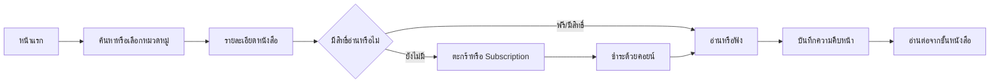

# Read & Voice — UX/UI Blueprint

## เป้าหมายผลิตภัณฑ์

ทำให้ผู้ใช้ค้นหา ซื้อ อ่าน และฟังหนังสือได้โดยมีขั้นตอนน้อยที่สุด พร้อมรองรับผู้ใช้สายตาเลือนราง โปรแกรมอ่านหน้าจอ คีย์บอร์ด และคำสั่งเสียงตั้งแต่ต้น

## กลุ่มผู้ใช้หลัก

1. **ผู้อ่านทั่วไป** — ค้นหา ซื้อ อ่าน ฟัง บันทึก และติดตามความคืบหน้า
2. **ผู้ใช้ที่ต้องการความช่วยเหลือด้านการมองเห็น** — ใช้ตัวอักษรใหญ่ คอนทราสต์สูง TTS, screen reader และคำสั่งเสียง
3. **นักเขียน** — อัปโหลดหนังสือ/ตอน จัดการผลงาน และดูสถิติ
4. **ผู้ดูแลระบบ** — อนุมัติเนื้อหา ดูแลสมาชิก การชำระเงิน และการตั้งค่าระบบ

## Information architecture

```text
Read & Voice
├─ ค้นพบ: หน้าแรก / ร้าน / ค้นหา / หมวดหมู่ / ซีรีส์
├─ อ่านและฟัง: รายละเอียดหนังสือ / Reader / Listen / ความคืบหน้า
├─ ซื้อและสิทธิ์: ตะกร้า / คอยน์ / คำสั่งซื้อ / Subscription
├─ บัญชี: ชั้นหนังสือ / โปรไฟล์ / การแจ้งเตือน / อุปกรณ์
├─ นักเขียน: Dashboard / ผลงาน / อัปโหลด / สถิติ / โปรไฟล์สาธารณะ
└─ ผู้ดูแล: Dashboard / หนังสือ / สมาชิก / การอนุมัติ / การเงิน / ระบบ
```

## User flow สำคัญ



## หลักการออกแบบ

- งานสำคัญต้องเข้าถึงได้ภายใน 1–3 ขั้นตอน
- ใช้ semantic HTML; ลิงก์สำหรับการนำทาง ปุ่มสำหรับการกระทำ
- เป้าหมายสัมผัสอย่างน้อย 44×44 px และมี focus state ที่เห็นชัด
- ไม่สื่อความหมายด้วยสีเพียงอย่างเดียว และรักษา contrast ตาม WCAG AA
- รองรับการขยายข้อความ 200% โดยไม่ตัดเนื้อหา
- Animation ต้องเคารพ `prefers-reduced-motion`
- ภาษาไทยสั้น ตรง และใช้คำเดิมอย่างสม่ำเสมอ

## Design direction

- **Primary:** Deep teal `#08786D`
- **Ink:** `#102A2A`
- **Canvas:** Warm paper `#F7F5ED`
- **Accent:** Amber `#EEAE39`
- **Type:** Sarabun / Noto Sans Thai
- **Shape:** การ์ดมุม 18–30 px, เส้นขอบชัด, พื้นที่ว่างมาก

## Responsive layout

- Desktop ≥ 961 px: hero สองคอลัมน์ และ quick actions สี่คอลัมน์
- Tablet 681–960 px: hero หนึ่งคอลัมน์ และ quick actions สองคอลัมน์
- Mobile ≤ 680 px: ทุกส่วนหนึ่งคอลัมน์ ปุ่ม CTA เต็มความกว้าง

## Prompt สำหรับสร้างต้นแบบใน Figma AI

> Design a Thai accessible ebook and text-to-speech platform named Read & Voice. Use a warm editorial canvas, deep teal primary color, large Sarabun typography, strong contrast, generous whitespace, rounded cards, visible keyboard focus, and 44px minimum targets. Create desktop 1440px and mobile 390px screens for Home, Store, Book Detail, Reader/Listen, Library, Wallet, Writer Dashboard, and Admin Dashboard. Prioritize screen-reader semantics and simple one-task-per-section flows.

## Definition of done

- ใช้งานด้วย Tab/Enter/Escape ได้ครบ
- Screen reader อ่านชื่อ บทบาท และสถานะได้ถูกต้อง
- ไม่มี horizontal scroll ที่ 320 px
- ข้อความและ control ผ่าน contrast AA
- Build ผ่าน และไม่มี TypeScript error
- ทดสอบเส้นทาง Discover → Book → Purchase/Access → Read/Listen → Continue
